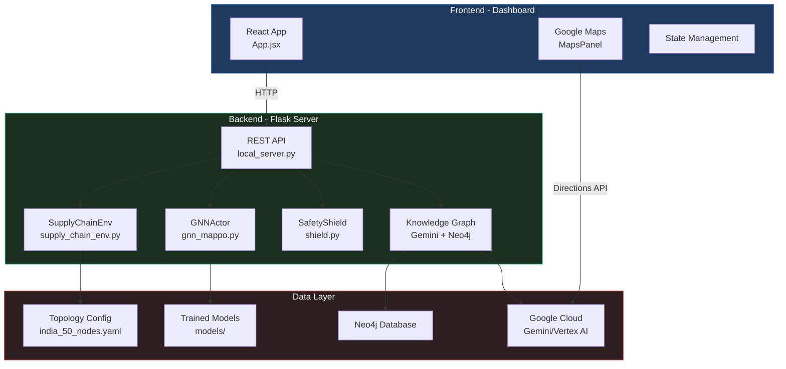
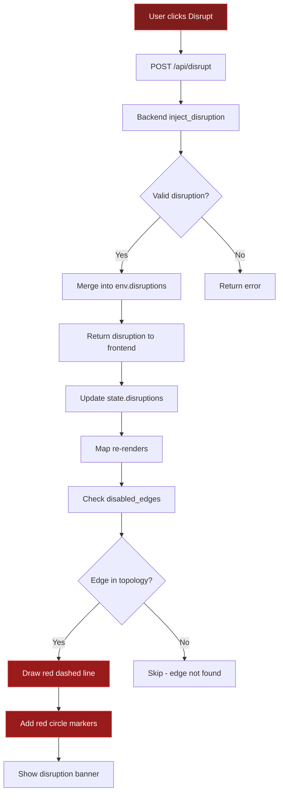
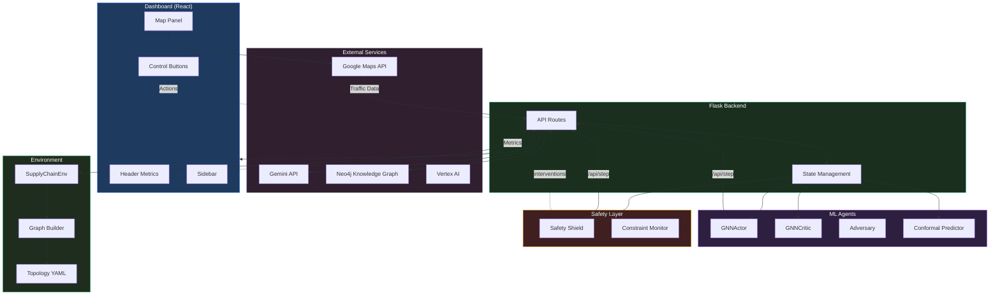
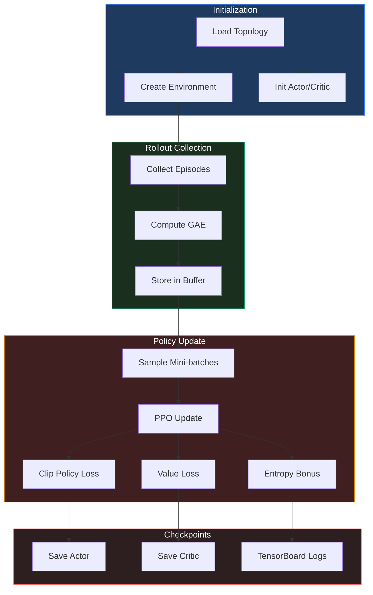
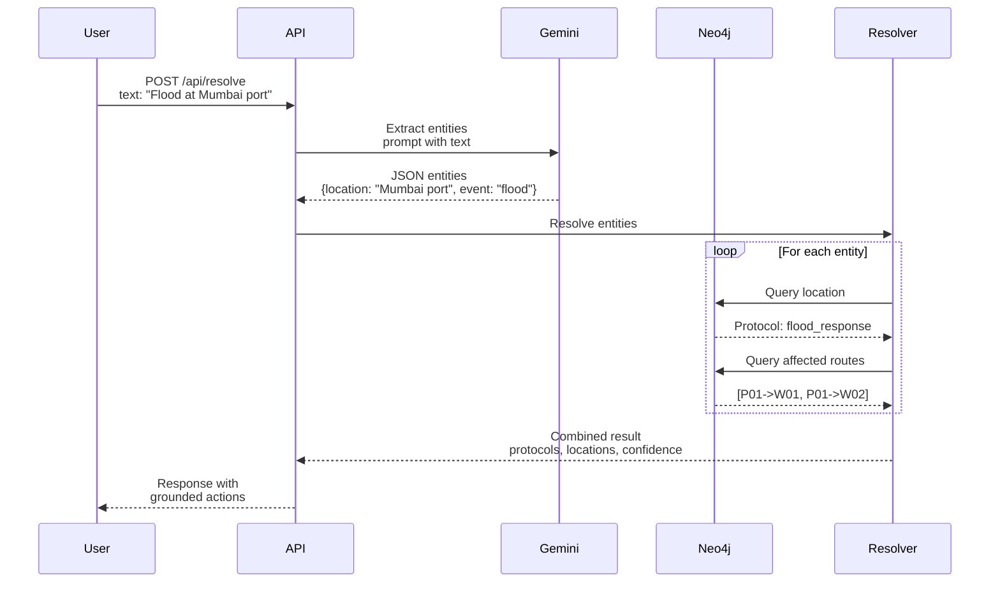
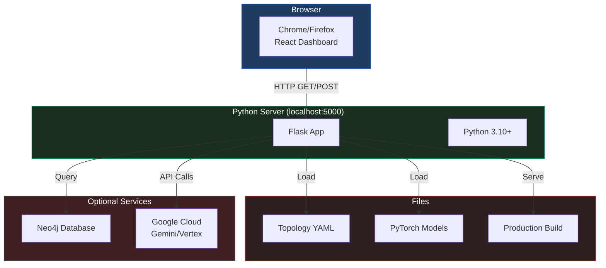
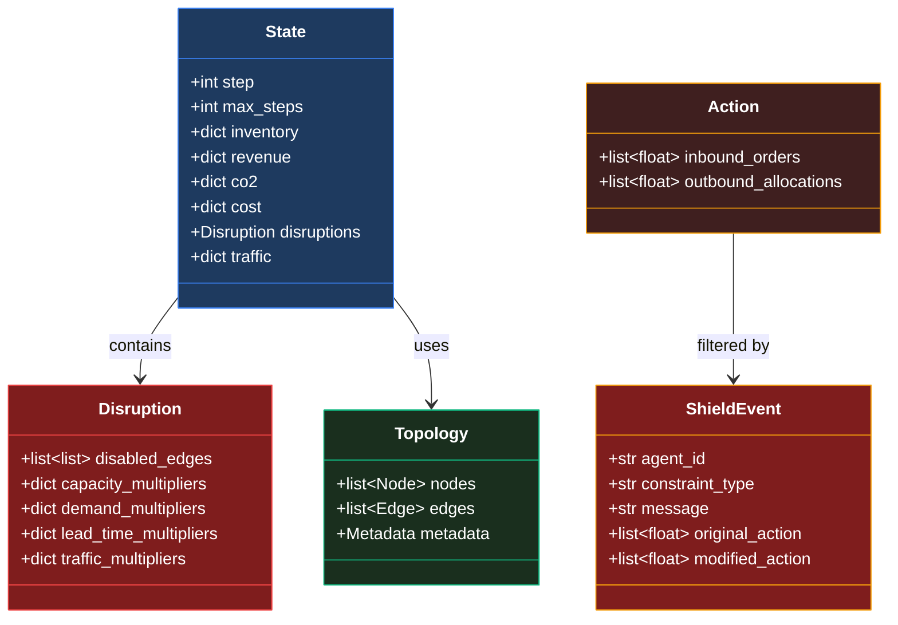
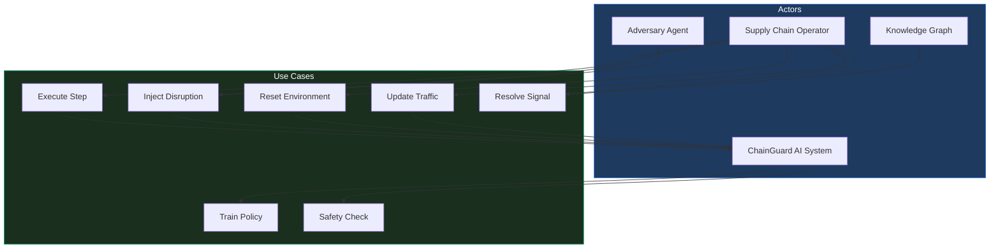

# ChainGuard AI - Mermaid Diagrams

This file contains comprehensive diagrams for the ChainGuard AI system.

> You can render these diagrams in:
> - VS Code with Mermaid extension
> - GitHub (native support)
> - Mermaid Live Editor: https://mermaid.live/
> - Notion, Obsidian, etc.

---

## 1. High-Level Architecture Diagram



---

## 2. Runtime Process Flow

```mermaid
sequenceDiagram
    participant User
    participant Dashboard
    participant API
    participant Env
    participant Actor
    participant Shield
    
    Dashboard->>Dashboard: User clicks "Step"
    
    Dashboard->>API: POST /api/step
    
    API->>Env: Get current observations
    Env-->>API: Return obs for all agents
    
    API->>Actor: Forward pass
    Actor-->>API: Return actions
    
    API->>Shield: Filter actions
    Shield-->>API: Return safe_actions + events
    
    API->>Env: Step(actions)
    Env-->>API: Return rewards, new state, done
    
    API-->>Dashboard: JSON {rewards, state, flows}
    
    Dashboard->>Dashboard: Update UI + animate trucks
    
    Note over User,Dashboard: Repeat until episode done
```

---

## 3. Disruption Flow



---

## 4. Agent Decision Flow

```mermaid
flowchart LR
    subgraph Input["Observation"]
        Inv[Inventory]
        Cost[Cost]
        CO2[CO2 Emissions]
        Step[Current Step]
        Supply[Supply Status]
        Traffic[Traffic Pressure]
    end
    
    subgraph Model["GNNActor Policy"]
        MLP[MLP Encoder]
        Head[Policy Head]
        Sample[Sample Action]
    end
    
    subgraph Shield["Safety Shield"]
        CheckCO2[Check CO2 Cap]
        CheckBudget[Check Budget]
        CheckHazmat[Check Hazmat]
        Filter[Modify Action]
    end
    
    subgraph Output["Environment"]
        StepEnv[Environment Step]
        Reward[Calculate Reward]
        NewState[New State]
    end
    
    Input --> MLP
    MLP --> Head
    Head --> Sample
    Sample --> CheckCO2
    CheckCO2 --> CheckBudget
    CheckBudget --> CheckHazmat
    CheckHazmat --> Filter
    Filter --> StepEnv
    StepEnv --> Reward
    Reward --> NewState
    
    style Input fill:#1e3a5f,stroke:#3b82f6,color:#fff
    style Model fill:#1a2f1e,stroke:#10b981,color:#fff
    style Shield fill:#3f1f1f,stroke:#f59e0b,color:#fff
    style Output fill:#2d1f1f,stroke:#ef4444,color:#fff
```



---

## 5. Complete System Architecture



---

## 6. Training Pipeline



---

## 7. Signal Resolution Flow (KG + Gemini)



---

## 8. Infrastructure Diagram



---

## 9. Data Contracts



---

## 10. Use Case Diagram



---

## Rendering Notes

1. **VS Code**: Install "Mermaid Preview" extension, create `.mmd` file, preview with `Ctrl+Shift+V`

2. **GitHub**: Native support - include in markdown file, view directly in repo

3. **Mermaid Live**: Copy-paste each diagram at https://mermaid.live/

4. **Export**: Can export as PNG/SVG from Mermaid Live Editor

---

*Generated for ChainGuard AI - Google Solution Challenge 2026*